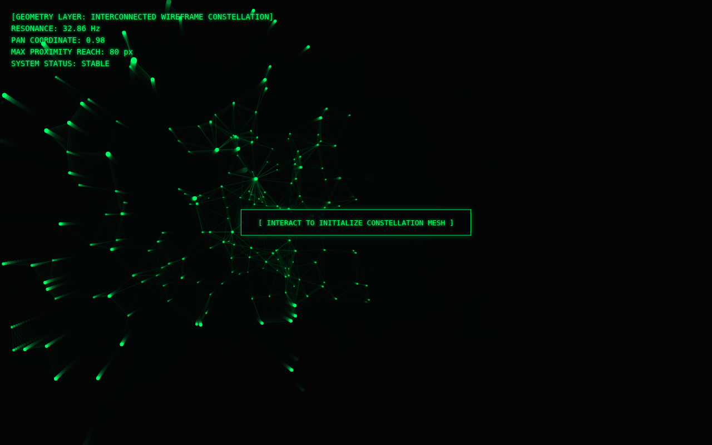

# The Unbound Net

The first cycle, where everything else started. A Go server streams a 'heartbeat' packet every 120 ms (a resonance frequency with random 'anomaly' spikes). A browser page draws it and turns it into sound. The front-end was rewritten five times in the transcript, as a heartbeat plot, then a 32 Hz Web Audio drone, then stereo panning, then a 3D particle field, a cinematic camera, and finally a constellation mesh. Around it are Python terminal simulations, a Node.js version of the stream, a Prometheus exporter, a Grafana dashboard and Kubernetes manifests.



## Run it

Without Docker (Go 1.21+), from this folder, in two terminals:

```sh
(cd backend && go run .)                       # WebSocket on :8080/
(cd frontend && python3 -m http.server 3000)   # then open http://localhost:3000
```

With Docker: `docker compose up --build` from this folder (not tested here; see the top-level README).

Terminal pieces: `bash terminal/run.sh`, `python terminal/terminal_interface.py`, `python terminal/vortex.py` (needs numpy), `python terminal/telemetry.py` (needs prometheus_client; serves `/metrics` on :8080). Node alternative to the Go stream: `cd node-proxy && npm install ws && node server.js`.

## What was checked

Go stream ran and the page received 52 frames with no JS errors. run.sh, terminal_interface.py and vortex.py run. telemetry.py serves real Prometheus metrics. server.js streams JSON. **Not run:** Kubernetes manifests and Grafana import (they parse, but there's no cluster here).

## Repairs to the transcript's code

- `backend/main.go`: gorilla/websocket import path restored; comment/declaration line split.
- `terminal/run.sh`: `while true; do` had been swallowed into a comment and `done` glued to `sleep 1.5`. The script parsed fine but never looped.
- Python files: glued `import` lines split; in `telemetry.py`, three metric definitions had been merged into a comment.
- `node-proxy/server.js`: two `const` declarations had been swallowed into comments.
- `k8s/*.yaml`: `kind:`, `metadata:`, `spec:`, `data:` and `---` separators split back onto their own lines.
- Dockerfiles: instructions split back onto separate lines.

`go.mod` / `go.sum` were generated here, following the transcript's own `go mod init` / `go get` steps. Every other change is visible with `git diff` against the verbatim-extraction commit.

## Where each file came from

| File | Transcript lines |
|---|---|
| `terminal/run.sh` | 227–247 |
| `terminal/vortex.py` | 303–324 |
| `terminal/terminal_interface.py` | 365–424 |
| `terminal/Dockerfile` | 450–458 |
| `k8s/deployment.yaml` | 502–545 |
| `k8s/configmap.yaml` | 587–598 |
| `terminal/telemetry.py` | 604–627 |
| `grafana/dashboard.json` | 672–761 |
| `node-proxy/server.js` | 803–840 |
| `frontend/history/v1-heartbeat.html` | 889–996 |
| `frontend/history/v2-audio.html` | 1030–1186 |
| `frontend/history/v3-spatial-audio.html` | 1218–1376 |
| `frontend/history/v4-particle-field.html` | 1409–1573 |
| `frontend/history/v5-cinematic.html` | 1608–1775 |
| `backend/main.go` | 1808–1881 |
| `docker-compose.yml` | 1923–1963 |
| `frontend/index.html` | 2024–2219 |
| `prometheus/prometheus.yml` | 2283–2290 |
| `backend/Dockerfile` | 2296–2307 |
