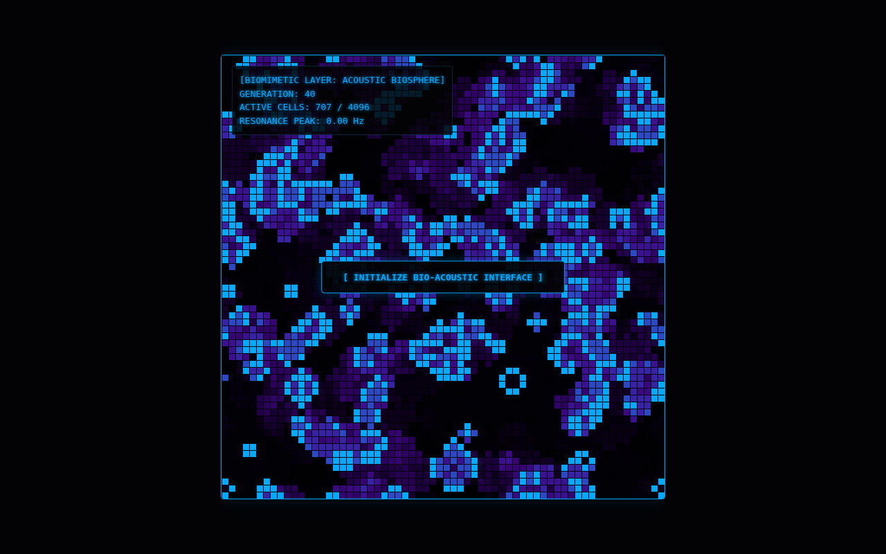

# Biomimetic Automata

A cellular automaton on a toroidal grid (Go) with births, decay and transformation, drawn as a 'bioluminescent' canvas. The final front-end adds generative polyphonic audio driven by the living-cell count.



## Run it

Without Docker (Go 1.21+), from this folder, in two terminals:

```sh
(cd backend && go run .)                       # WebSocket on :8080/bio-stream
(cd frontend && python3 -m http.server 3000)   # then open http://localhost:3000
```

With Docker: `docker compose up --build` from this folder (not tested here; see the top-level README).

## What was checked

Ran and the page received 40 frames with no JS errors.

## Repairs to the transcript's code

- gorilla/websocket import; comment/declaration splits; Dockerfile instruction splits and `go.sum` copy.

`go.mod` / `go.sum` were generated here, following the transcript's own `go mod init` / `go get` steps. Every other change is visible with `git diff` against the verbatim-extraction commit.

## Where each file came from

| File | Transcript lines |
|---|---|
| `backend/main.go` | 3266–3393 |
| `frontend/history/v1-biosphere.html` | 3426–3519 |
| `frontend/index.html` | 3555–3704 |
| `backend/Dockerfile` | 3739–3749 |
| `docker-compose.yml` | 3795–3822 |
