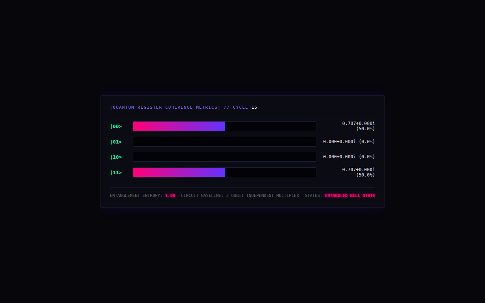

# Quantum Circuit Simulator

A 2-qubit state-vector simulator in Go. It applies a Hadamard then a CNOT (the circuit that makes a Bell state) and streams the amplitudes and Born-rule probabilities to a monitor page.



## Run it

Without Docker (Go 1.21+), from this folder, in two terminals:

```sh
(cd backend && go run .)                       # WebSocket on :8080/quantum-stream
(cd frontend && python3 -m http.server 3000)   # then open http://localhost:3000
```

With Docker: `docker compose up --build` from this folder (not tested here; see the top-level README).

## What was checked

Ran and the page received 15 frames with no JS errors.

## Repairs to the transcript's code

- gorilla/websocket import; comment/declaration splits; Dockerfile fixes.

`go.mod` / `go.sum` were generated here, following the transcript's own `go mod init` / `go get` steps. Every other change is visible with `git diff` against the verbatim-extraction commit.

## Where each file came from

| File | Transcript lines |
|---|---|
| `backend/main.go` | 3995–4107 |
| `frontend/index.html` | 4134–4238 |
| `backend/Dockerfile` | 4266–4276 |
| `docker-compose.yml` | 4321–4348 |
