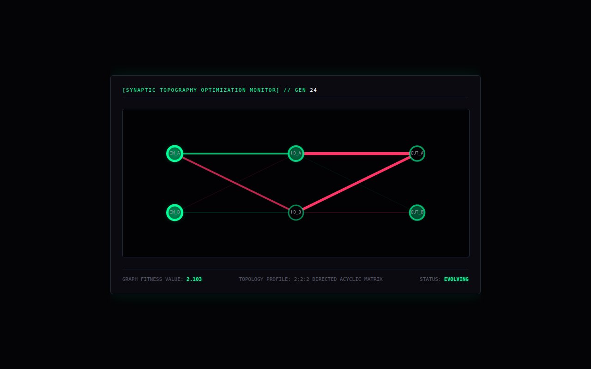

# Neuro-Evolutionary Graph

A 6-node neural graph with sigmoid activations. Each generation, some synapse weights get random nudges and the network is scored against an XOR target. There's no selection step, since every nudge is kept, so the 'evolution' is really a random walk with a fitness readout. The page draws the activations and weights.



## Run it

Without Docker (Go 1.21+), from this folder, in two terminals:

```sh
(cd backend && go run .)                       # WebSocket on :8080/neural-stream
(cd frontend && python3 -m http.server 3000)   # then open http://localhost:3000
```

With Docker: `docker compose up --build` from this folder (not tested here; see the top-level README).

## What was checked

Ran and the page received 24 frames with no JS errors.

## Repairs to the transcript's code

- gorilla/websocket import; comment/declaration splits; Dockerfile fixes.

`go.mod` / `go.sum` were generated here, following the transcript's own `go mod init` / `go get` steps. Every other change is visible with `git diff` against the verbatim-extraction commit.

## Where each file came from

| File | Transcript lines |
|---|---|
| `backend/main.go` | 4487–4615 |
| `frontend/index.html` | 4644–4790 |
| `backend/Dockerfile` | 4823–4833 |
| `docker-compose.yml` | 4871–4898 |
