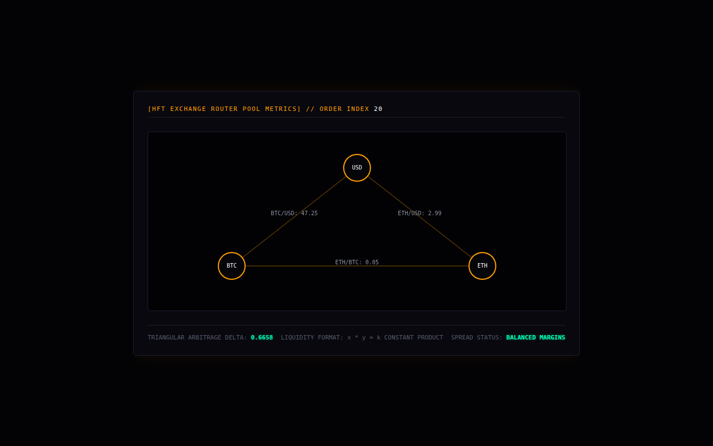

# Market Graph Engine

Three constant-product automated market makers (x·y = k) for BTC/USD, ETH/USD and ETH/BTC, hit by random trade shocks. The engine measures the triangular arbitrage gap between them and streams it to an order-book style page.



## Run it

Without Docker (Go 1.21+), from this folder, in two terminals:

```sh
(cd backend && go run .)                       # WebSocket on :8080/market-stream
(cd frontend && python3 -m http.server 3000)   # then open http://localhost:3000
```

With Docker: `docker compose up --build` from this folder (not tested here; see the top-level README).

## What was checked

Ran and the page received 20 frames with no JS errors.

## Repairs to the transcript's code

- gorilla/websocket import; comment/declaration splits; Dockerfile fixes.

`go.mod` / `go.sum` were generated here, following the transcript's own `go mod init` / `go get` steps. Every other change is visible with `git diff` against the verbatim-extraction commit.

## Where each file came from

| File | Transcript lines |
|---|---|
| `backend/main.go` | 5036–5143 |
| `frontend/index.html` | 5171–5323 |
| `backend/Dockerfile` | 5354–5364 |
| `docker-compose.yml` | 5402–5429 |
