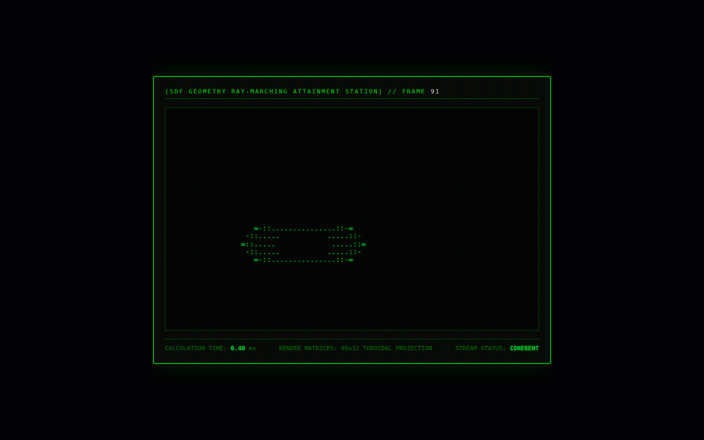

# Ray Marcher

A signed-distance-field ray marcher in Go. It renders a rotating torus as 60×32 ASCII art and streams each frame to a CRT-styled page.



## Run it

Without Docker (Go 1.21+), from this folder, in two terminals:

```sh
(cd backend && go run .)                       # WebSocket on :8080/ray-stream
(cd frontend && python3 -m http.server 3000)   # then open http://localhost:3000
```

With Docker: `docker compose up --build` from this folder (not tested here; see the top-level README).

## What was checked

Ran and the page received 91 frames with no JS errors; the torus renders.

## Repairs to the transcript's code

- Several declarations had been merged onto one line (`…}func (v Vector3) Scale…`).
- Original bug: `Math.Cos` / `Math.Sin` (JavaScript spelling) changed to Go's `math.Cos` / `math.Sin`.
- gorilla/websocket import; Dockerfile fixes.

`go.mod` / `go.sum` were generated here, following the transcript's own `go mod init` / `go get` steps. Every other change is visible with `git diff` against the verbatim-extraction commit.

## Where each file came from

| File | Transcript lines |
|---|---|
| `backend/main.go` | 6233–6376 |
| `frontend/index.html` | 6409–6475 |
| `backend/Dockerfile` | 6507–6517 |
| `docker-compose.yml` | 6565–6592 |
