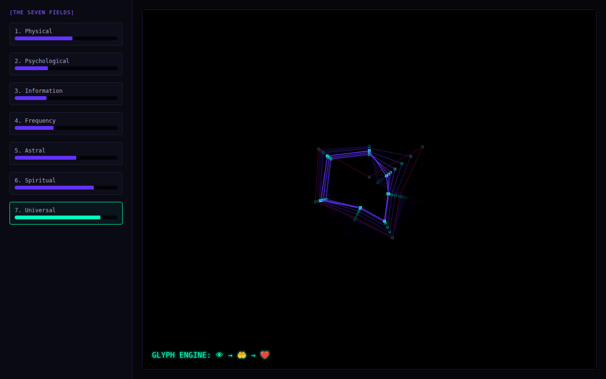

# The Living Codex

A symbolic state machine over 'seven planes' (Physical, Psychological, Spiritual, and so on) that drift and couple over time, shown on a seven-plane page.



## Run it

Without Docker (Go 1.21+), from this folder, in two terminals:

```sh
(cd backend && go run .)                       # WebSocket on :8080/codex-stream
(cd frontend && python3 -m http.server 3000)   # then open http://localhost:3000
```

With Docker: `docker compose up --build` from this folder (not tested here; see the top-level README).

## What was checked

Ran and the page received 30 frames with no JS errors.

## Repairs to the transcript's code

- gorilla/websocket import; comment/declaration splits.
- The Dockerfile only exists inside the transcript's README. It reuses the quantum project's folder and binary names, but consistently, so it still builds; it's left as is.

`go.mod` / `go.sum` were generated here, following the transcript's own `go mod init` / `go get` steps. Every other change is visible with `git diff` against the verbatim-extraction commit.

## Where each file came from

| File | Transcript lines |
|---|---|
| `backend/main.go` | 6737–6877 |
| `frontend/index.html` | 6883–7001 |
| `docker-compose.yml` | 7033–7060 |
| `backend/Dockerfile` | 7131–7143 |
