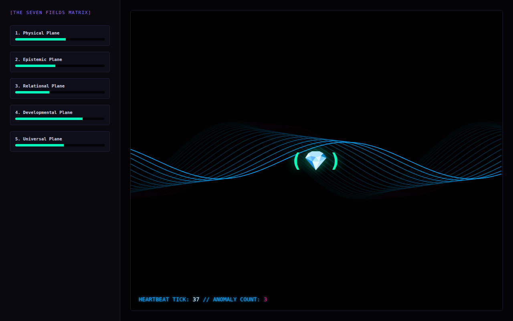

# Kernel Lineage

The most layered cycle. A Go state engine streams 'wrapper' and 'aperture' states and records each heartbeat in a SQLite lineage ledger. A Python analyzer reads the ledger and reports the trend. A separate Go alert manager scans it for runaway velocity and posts to an `/admin/override` webhook.



## Run it

Without Docker (Go 1.21+), from this folder, in two terminals:

```sh
(cd backend && go run .)                       # WebSocket on :8080/kernel-stream
(cd frontend && python3 -m http.server 3000)   # then open http://localhost:3000
```

With Docker: `docker compose up --build` from this folder (not tested here; see the top-level README).

Analyzer: run `python plugins/lineage_analysis.py` from the project root after the backend has written `backend/unbound_matrix.db`. Alert manager: `go build -o alertmanager/alertmanager ./alertmanager && (cd backend && ../alertmanager/alertmanager)`. It opens `./unbound_matrix.db`, so run it from `backend/`. `history/` holds the first `main.go`, the first Dockerfile, and two patch snippets that the transcript said to merge by hand.

## What was checked

All three pieces ran together: the backend wrote the SQLite ledger, the analyzer printed its lineage table, and the alert manager reported a healthy mean velocity. **Known unresolved issue (Docker only, untested):** the Go container writes its database to `/root/` but the shared volume in the patch is mounted at `/app`, so under docker-compose the analyzer would not see the data. Also, the `/admin/override` route the alert manager calls only exists as the patch snippet `history/main.webhook-patch.go`, which is not merged into `backend/main.go`, so that POST would get a 404. The compose file's `TARGET_WS_URL` / `INTERACTION_PLANE` are also unused, because the 'agent duet' they were meant for was never written.

## Repairs to the transcript's code

- `alertmanager.go` moved to `alertmanager/main.go`, since it's a separate program with its own `main()` and can't share a package with the backend.
- Two SQLite imports restored as `github.com/mattn/go-sqlite3`. The driver is registered as `"sqlite3"` and the Dockerfile enables CGO for it.
- Several declarations had been merged onto one line (`…}type Hub struct…`, `…}func (c *Client) ReadPump…`).
- Original bug in the alert manager: `time.sleep` changed to `time.Sleep`.
- `lineage_analysis.py`: imports split; one line indented with tabs among spaces fixed.
- Dockerfiles: instruction splits; `go get` path restored; `go.sum` copy.

`go.mod` / `go.sum` were generated here, following the transcript's own `go mod init` / `go get` steps. Every other change is visible with `git diff` against the verbatim-extraction commit.

## Where each file came from

| File | Transcript lines |
|---|---|
| `docker-compose.yml` | 7199–7242 |
| `history/main.v1.go` | 7248–7395 |
| `frontend/index.html` | 7401–7514 |
| `history/Dockerfile.v1` | 7520–7521 |
| `backend/main.go` | 7563–7735 |
| `backend/Dockerfile` | 7741–7742 |
| `plugins/lineage_analysis.py` | 7776–7842 |
| `plugins/Dockerfile` | 7848–7848 |
| `history/docker-compose.volume-patch.yml` | 7854–7865 |
| `backend/alertmanager.go` | 7904–7985 |
| `history/main.webhook-patch.go` | 7991–8009 |
(`alertmanager/main.go` was extracted as `backend/alertmanager.go`.)
