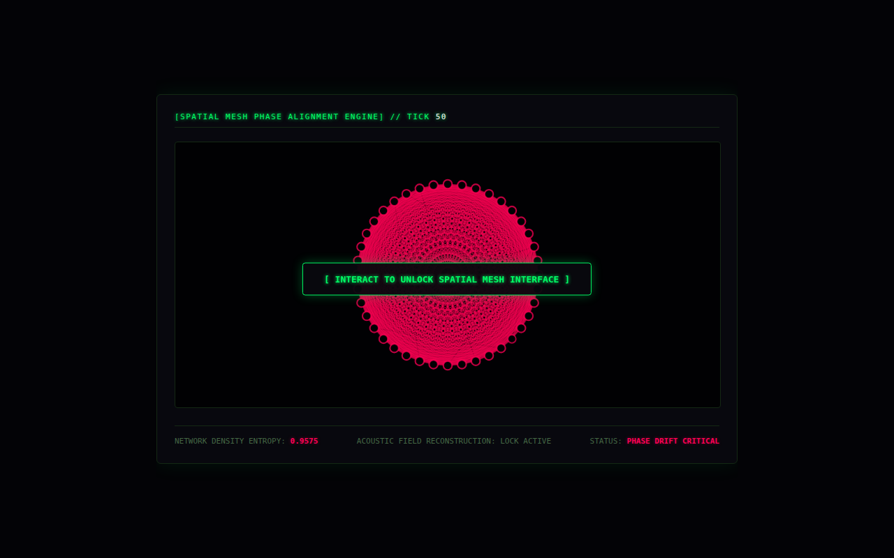

# Adaptive Graph Metabolism

A graph automaton: each node's 'potential' moves toward a sigmoid of its neighbours' average, with random jolts. Links between nodes whose potentials drift apart get cut and new ones form, so the topology keeps reorganising. The final page draws the mesh and makes sound from it (the audio waits for a click).



## Run it

Without Docker (Go 1.21+), from this folder, in two terminals:

```sh
(cd backend && go run .)                       # WebSocket on :8080/graph-stream
(cd frontend && python3 -m http.server 3000)   # then open http://localhost:3000
```

With Docker: `docker compose up --build` from this folder (not tested here; see the top-level README).

## What was checked

Ran and the page received 50 frames with no JS errors.

## Repairs to the transcript's code

- Original bug: `math` used but not imported.
- gorilla/websocket import; YAML and Dockerfile splits.

`go.mod` / `go.sum` were generated here, following the transcript's own `go mod init` / `go get` steps. Every other change is visible with `git diff` against the verbatim-extraction commit.

## Where each file came from

| File | Transcript lines |
|---|---|
| `backend/dynamic_graph_engine.go` | 8060–8213 |
| `frontend/history/v1-topology.html` | 8241–8387 |
| `backend/Dockerfile` | 8423–8430 |
| `docker-compose.yml` | 8473–8513 |
| `prometheus/prometheus.yml` | 8535–8541 |
| `frontend/index.html` | 8579–8744 |
