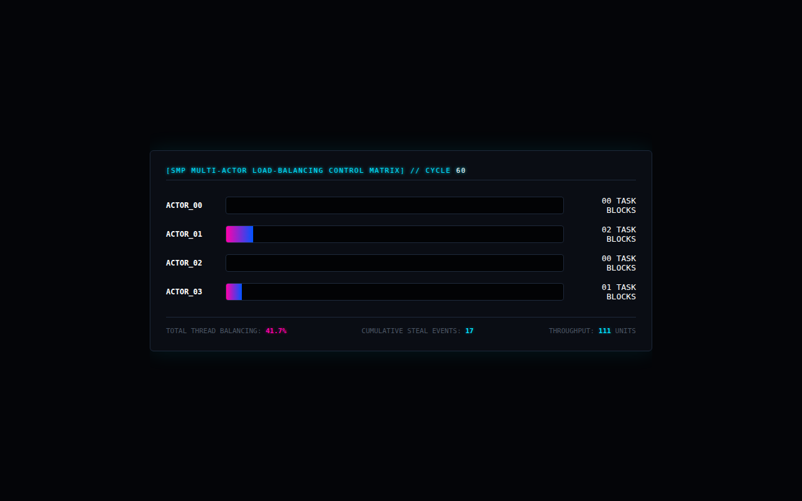

# Work-Stealing Scheduler

A 4-worker pool in Go where idle workers steal tasks from busy ones. It streams queue sizes, steal counts, throughput and a Gini-coefficient balance score to a page.



## Run it

Without Docker (Go 1.21+), from this folder, in two terminals:

```sh
(cd backend && go run .)                       # WebSocket on :8080/scheduler-stream
(cd frontend && python3 -m http.server 3000)   # then open http://localhost:3000
```

With Docker: `docker compose up --build` from this folder (not tested here; see the top-level README).

## What was checked

Ran and the page received 60 frames with no JS errors.

## Repairs to the transcript's code

- Garbled line `scheduler CentralScheduler.Mu.Lock()` changed to `scheduler.Mu.Lock()`, matching the `scheduler.Mu.Unlock()` a few lines later.
- Original bug: `math` used but not imported.
- Front-end: `let lastQueueSizes =;` had lost its array literal, which is a syntax error that stopped the whole page. Restored as `[0, 0, 0, 0]`, one entry per worker, since the code compares each entry to 0.
- docker-compose and prometheus.yml: keys that had been glued onto the previous line were split back out.

`go.mod` / `go.sum` were generated here, following the transcript's own `go mod init` / `go get` steps. Every other change is visible with `git diff` against the verbatim-extraction commit.

## Where each file came from

| File | Transcript lines |
|---|---|
| `backend/scheduling_engine.go` | 8817–9001 |
| `frontend/index.html` | 9007–9115 |
| `backend/Dockerfile` | 9143–9150 |
| `docker-compose.yml` | 9189–9227 |
| `prometheus/prometheus.yml` | 9249–9254 |
