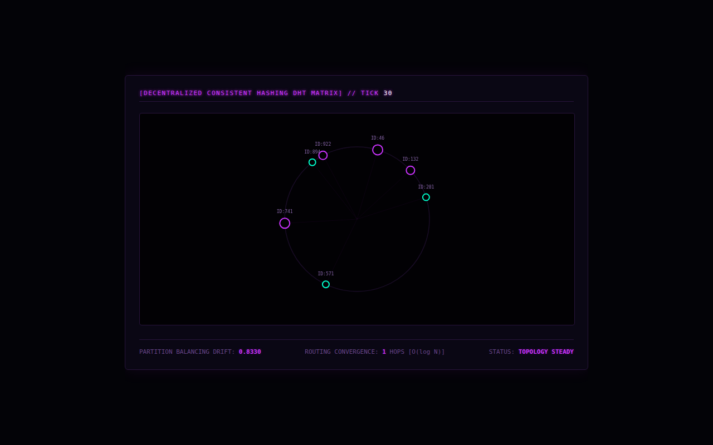

# DHT Chord Ring

Consistent hashing on a Chord-style ring. Storage nodes join and leave, and keys are reassigned to their successor node on the ring. Despite the name there are no finger tables: the 'routing hops' figure is a random number capped at log₂ N, not a real lookup. The page shows the ring live.



## Run it

Without Docker (Go 1.21+), from this folder, in two terminals:

```sh
(cd backend && go run .)                       # WebSocket on :8080/chord-stream
(cd frontend && python3 -m http.server 3000)   # then open http://localhost:3000
```

With Docker: `docker compose up --build` from this folder (not tested here; see the top-level README).

## What was checked

Ran and the page received 30 frames with no JS errors.

## Repairs to the transcript's code

- Original bug: `rand.Int64()` doesn't exist in `math/rand`; changed to `rand.Int63()`.
- gorilla/websocket import; Dockerfile splits.

`go.mod` / `go.sum` were generated here, following the transcript's own `go mod init` / `go get` steps. Every other change is visible with `git diff` against the verbatim-extraction commit.

## Where each file came from

| File | Transcript lines |
|---|---|
| `backend/dht_chord_engine.go` | 9299–9491 |
| `frontend/index.html` | 9497–9620 |
| `backend/Dockerfile` | 9645–9652 |
| `docker-compose.yml` | 9687–9727 |
| `prometheus/prometheus.yml` | 9749–9755 |
