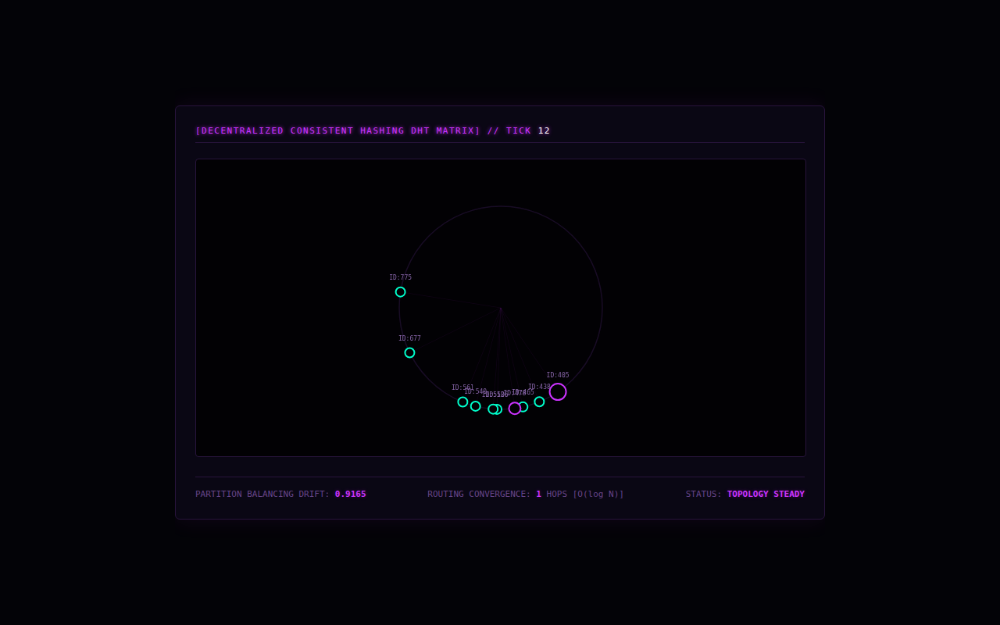

# Chord, for real (cycle 14)

This is the first cycle written in this session rather than recovered from the
transcript.

Reading all 13 earlier cycles, what stood out was that several simulations
only *look* like what they name. Cycle 13's "Chord ring" was the clearest case.
It reports routing hops as `1 + rand.Intn(log2(N) + 1)`, a random number, and
has no finger tables. So this cycle implements the actual protocol from Stoica
et al., *Chord: A Scalable Peer-to-peer Lookup Service* (SIGCOMM 2001), and
checks it against the paper's prediction.

- Each node knows only its **successor, predecessor and finger table**
  (`finger[i] = successor(id + 2^i)`).
- **Lookups** forward to the closest preceding finger until the key falls
  between a node and its successor. The hops are counted, not generated.
- **Joins** only learn their successor (through a lookup from a random node).
  **Leaves** are graceful and hand their neighbours to each other. Periodic
  **stabilize** and **fix_fingers** repair everything else, one finger per node
  per round.
- The simulator also knows the true owner of every key, so every lookup is
  checked, and stale routing state shows up as a measured error rate.

The streamed JSON keeps cycle 13's fields, so `frontend/index.html` is cycle
13's page, unchanged. It now shows real hop counts. Two fields are new:
`lookupCorrect` and `staleFingers`.



## Result 1: a stable ring matches the paper

The paper reports that the average lookup path is about ½·log₂ N. Here
(identifier space 2²⁰, 20,000 random lookups per row, `go run . -experiment`):

| N | rounds to converge | mean hops | ½·log₂ N | ratio | lookups correct |
|---:|---:|---:|---:|---:|---:|
| 8 | 20 | 1.39 | 1.50 | 0.92 | 100.00% |
| 16 | 20 | 1.72 | 2.00 | 0.86 | 100.00% |
| 32 | 20 | 2.44 | 2.50 | 0.98 | 100.00% |
| 64 | 20 | 2.82 | 3.00 | 0.94 | 100.00% |
| 128 | 20 | 3.47 | 3.50 | 0.99 | 100.00% |
| 256 | 21 | 3.88 | 4.00 | 0.97 | 100.00% |
| 512 | 20 | 4.36 | 4.50 | 0.97 | 100.00% |
| 1024 | 20 | 4.87 | 5.00 | 0.97 | 100.00% |
| 2048 | 20 | 5.36 | 5.50 | 0.97 | 100.00% |

Across a 256× range of ring sizes, measured hops are 0.94–0.99 × ½·log₂ N
from N = 32 up, consistently a little under. (Here "hops" counts node-to-node
forwards. I haven't pinned down why it runs slightly low.)
Convergence always takes about 20 rounds, whatever N is. That's because fix_fingers refreshes one of the 20
fingers per round, so the repair schedule, not the ring size, sets the time.

## Result 2: under churn, errors come from brand-new nodes

With N = 256 and some fraction of nodes replaced every round (one maintenance
round between each batch):

| nodes replaced per round | stale fingers | mean hops | lookups correct |
|---:|---:|---:|---:|
| 0% | 0.0% | 3.85 | 100.00% |
| 0.5% | 13.2% | 4.07 | 99.57% |
| 1% | 24.1% | 4.34 | 99.01% |
| 2% | 39.3% | 4.84 | 98.04% |
| 5% | 65.0% | 7.09 | 95.00% |
| 10% | 80.6% | 13.23 | 89.45% |
| 20% | 90.7% | 33.60 | 73.17% |

Two things stood out.

**Lookups stay correct even when most fingers are stale.** At 5% churn, 65%
of fingers point at the wrong node, yet 95% of lookups still land on the right
owner. Stale fingers make lookups *slower* (hops nearly double, 3.85 → 7.09), not
*wrong*, because correctness rests only on successor pointers. That's the
design argument in the Chord paper, and here it shows up in measured numbers.

**At low churn, the error rate matches the replacement rate almost exactly**
(0.5% → 0.43%, 1% → 0.99%, 2% → 1.96%, 5% → 5.00%). A diagnostic run that
classified every wrong lookup explains it:

- at 1% churn, 407 of 412 wrong lookups were for keys whose true owner had
  joined *in that same round*, and in all 412 the owner's predecessor did not
  yet point to it;
- at 5% churn: 1,888 of 2,001 were same-round joins, and again all 2,001 had
  a predecessor that didn't know them yet.

So a new node is invisible to lookups until its predecessor's next stabilize.
Until then the keys it now owns resolve to the old owner. A replacement rate
of r means new nodes own about r of the key space, so about r of lookups miss.
The *exactly one round* lag is partly an artifact of this simulator, which runs
maintenance in ID order, so a predecessor always stabilizes before its new
successor has announced itself. In an unsynchronized network it would
sometimes be shorter. At 20% churn the pattern breaks down: 2,821 of 10,654
errors involve owners that joined 1–3 rounds earlier, and 557 more involve
owners that are older or were there from the start. Runs of adjacent new nodes
take several rounds to link up, and the errors compound.

## Run it

```sh
cd backend
go test -v .            # correctness tests: routing on stable rings, repair after churn
go run . -experiment    # prints both tables above (about 3 seconds)
go run .                # live stream on ws://localhost:8080/chord-stream
```

Then serve `frontend/` (`python3 -m http.server 3000`) and open
http://localhost:3000. With Docker: `docker compose up --build` (the build
steps were replayed locally, but Docker itself wasn't available to run).

## Limits

- Leaves are graceful. Crash failures would need successor lists, which
  aren't implemented. A node with a dead successor and no list would be stuck.
- The live stream uses an identifier space of 1000 to fit cycle 13's
  0–999 layout. The experiments use 2²⁰.
- Joins bootstrap through a random live node and then rely on stabilization,
  as in the paper. Concurrent joins in the same round can briefly misroute,
  and that's what Result 2 measures.
